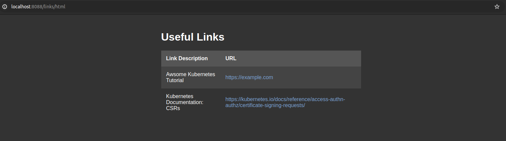

# API Server with Gin Framework and SQLite Database

This repository contains a simple API server implemented in Go using the Gin web framework and SQLite database. The server provides RESTful API endpoints for managing data, and it utilizes the modernc.org/sqlite package for database operations.

_NOTE: I use this apiserver/project to store my useful links. There is also a shell script included that will simplify the curl command to POST new links._

Usage of the script:
```bash
/sh/add_links.sh "Link Description" "https://<link-name>.com"
```
## How does it look?



## Prerequisites
Before you begin, ensure you have the following installed on your system:

Go (version >= 1.16)

Git

## Getting Started
* Clone the Repository:

```bash
git clone https://github.com/a1010s/API-Server-with-Gin-Framework-and-SQLite-Database
cd apiserver
```

* Install Dependencies:

```bash
go mod download
```
* Run the Application:

```bash
go run main.go -db-path=/path/to/create/links.db
The server will start running on http://localhost:8088.
```

## API Endpoints

GET /links/:id: Retrieve a specific resource by ID.
POST /links/resource: Create a new resource.
PUT /links/resource/:id: Update an existing resource by ID.
DELETE /links/resource/:id: Delete a resource by ID.
_NOTE: Not all the API Endpoints are yet implemented_

## Usage
To use the API endpoints, send HTTP requests to the appropriate URLs using tools like cURL or Postman. Make sure to include the necessary request parameters and headers based on the endpoint requirements.

Example:
```bash
Create a New Resource

curl -X POST -H "Content-Type: application/json" \
     -d '{"description": "New Link", "address": {"url": "https://example.com"}}' \
     http://localhost:8088/links
```
**For detailed information about the API endpoints and request payloads, refer to the routes.go and handlers.go files in the components directory.**

## Configuration
The server can be configured using command-line flags. Here is an example of how to specify the database file path:

```bash
go run main.go --db-path /path/to/your/database.db
```
## Contributing
Contributions are welcome! Please feel free to submit a pull request or open an issue for bug fixes, features, or improvements.

License
This project is licensed under the MIT License - see the LICENSE file for details.